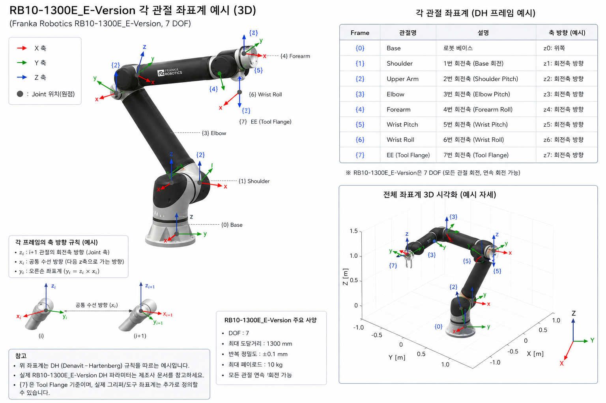
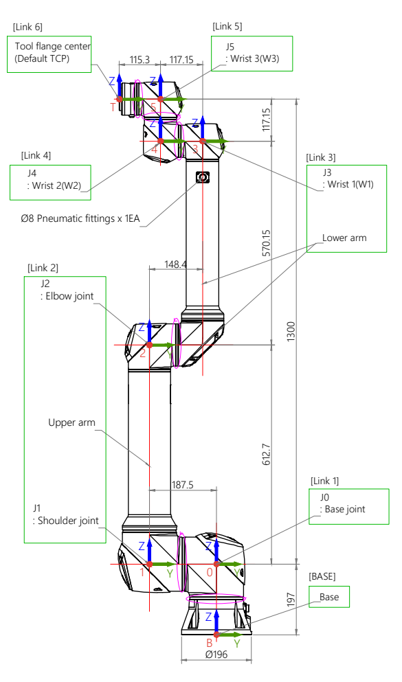

# URDF 생성을 위한 기준 좌표계 정의도

> 이 문서는 단순한 "기구도"가 아니라, **URDF(Universal Robot Description Format)를 만들기 위한 핵심 기준 좌표계 정의도**에 대한 설명입니다.
>
> 로봇의 각 링크(Link)와 관절(Joint)의 **위치 / 방향 / 회전축**을 정의하기 위한 설계 문서입니다.
>
> 이 그림 하나로 다음을 만들 수 있습니다:
> - URDF
> - DH Parameter
> - Forward Kinematics
> - Inverse Kinematics
> - Jacobian
> - ROS2 TF Tree
> - MoveIt Motion Planning
> - Isaac Sim / Gazebo 모델

---





**실제 산업 현장에서는:**
```
기구 도면(CAD)
→ 좌표계 정의
→ DH Parameter
→ URDF 생성
```
* 순서로 진행합니다.
* Joint 위치, 회전축, 링크 길이, 좌표계 방향이 정의되어 있기 때문에 URDF 생성에 필요한 핵심 정보가 거의 들어있습니다.


**1. 현재 그림으로 가능한 것**

   * 현재 정보만으로도:
      * Link 구조
      * Joint Tree
      * Joint Axis
      * Origin 위치
      * FK/IK 테스트용 URDF
   * 는 충분히 만들 수 있습니다.
   * 즉:
      * MoveIt
      * RViz
      * Gazebo
      * Isaac Sim
   * 에서 동작하는 기본 모델 생성 가능.

**2. 추가로 필요한 정보**

* 실제 정밀 URDF에는 다음이 추가 필요합니다.

| 항목 | 	필요 이유 | 
|:-------:| :-------:|
| STL/STEP/DAE Mesh	| 3D 외형 | 
| 정확한 Joint Limit	| 회전 범위 | 
| 질량(Mass)	| Dynamics | 
| Inertia Tensor	| 물리 시뮬레이션 | 
| CoM	| 무게 중심 | 
| TCP 정의| 	Tool 기준 | 

**3. URDF 기본 구조**

* URDF는 이런 형태입니다.

```XML
<robot name="rb10">

    <link name="base_link"/>

    <joint name="joint1" type="revolute">
        <parent link="base_link"/>
        <child link="link1"/>

        <origin xyz="0 0 0.197"
                rpy="0 0 0"/>

        <axis xyz="0 0 1"/>
    </joint>

    <link name="link1"/>

</robot>
```


**4. 그림에서 무엇을 읽어내는가?**

* 예를 들어:

```
612.7 mm
```
↓
```XML
<origin xyz="0 0 0.6127"/>
```
* 그리고:
```
파란 Z축
```
↓
```XML
<axis xyz="0 0 1"/>
```

**5. 실제 생성 흐름**

* 실제 개발 흐름:
```
CAD
 ↓
STEP/STL 추출
 ↓
좌표계 설정
 ↓
URDF 생성
 ↓
RViz 검증
 ↓
MoveIt IK 설정
 ↓
Isaac Sim Import
```
입니다.

**6. ROS2에서 매우 중요**

* URDF가 있으면 자동으로:
   * TF Tree
   * Robot State Publisher
   * RViz Robot Model
   * MoveIt Planning
   * IK Solver
   * 가 연결됩니다.

**7. 지금 그림 기준으로 가능한 수준**

   * 현재 정보로 만들 수 있는 것:

| 기능	| 가능 여부 | 
|:-------:| :-------:|
| 기본 URDF	| 가능 | 
| RViz 표시	| 가능 | 
| FK	| 가능 | 
| IK	| 가능 | 
| MoveIt	| 가능 | 
| Isaac Sim | Import	가능 | 
| Gazebo Physics	| 일부 가능 | 
| 정확한 Dynamics	| 추가 정보 필요 | 

**8. 실제로 가장 많이 하는 방식**

* 보통은:
```
SolidWorks
Fusion360
Inventor
Creo
```
* 에서:
```
URDF Export Plugin
```
* 을 사용합니다.
* 하지만:
```
좌표계가 틀리면 전부 망가짐
```
* 그래서 결국 지금 같은 좌표계 검증 작업이 가장 중요합니다.

**9. 지금 바로도 가능한 것**

* 현재 그림 기반으로:
   * URDF
   * Xacro
   * ROS2 package
   * TF Tree
   * RViz launch
   * MoveIt config

* 까지 생성 가능합니다.

**10. 특히 중요한 부분**

* URDF 생성에서 가장 어려운 부분은:
```
Joint Origin
Joint Axis
```
* 입니다.
* 지금 그림은 바로 그걸 설명하는 자료입니다.

---

## 1. 전체 구조

그림의 핵심 구조는 다음과 같습니다:

```
[Base]
  ↓
  J0
  ↓
Link1
  ↓
  J1
  ↓
Link2
  ↓
  J2
  ↓
  ...
```

즉, **Link -- Joint -- Link -- Joint** 구조입니다.
URDF도 정확히 같은 구조로 이루어집니다.

---

## 2. 그림에서 가장 중요한 요소

이 그림에는 4가지 핵심 정보가 포함되어 있습니다:

| 요소 | 의미 |
|------|------|
| 빨강 X | X축 |
| 초록 Y | Y축 |
| 파랑 Z | Z축 |
| 보라색 원 | 회전축 (Joint Axis) |

---

## 3. URDF에서 제일 중요한 것 = Joint Origin

URDF의 핵심은 `<origin>` 태그입니다:

```xml
<joint>
    <origin xyz="" rpy=""/>
</joint>
```

이 그림은 바로 그 **origin**을 정의하기 위한 그림입니다.

---

## 4. 좌표계(Frame)의 의미

그림의 숫자 `0, 1, 2, 3, 4, 5, 6`은 각각의 좌표계(Frame)를 의미합니다:

- Frame {0}
- Frame {1}
- Frame {2}
- ...

---

## 5. Base Frame

맨 아래 `[BASE]`는 월드 기준 좌표계입니다.
즉, `world` 또는 `base_link`가 됩니다.

ROS TF Tree에서는 다음과 같습니다:

```
world
 └── base_link
```

---

## 6. J0 = 첫 번째 관절

그림에서 `[Link1] J0 : Base joint`의 의미는 **첫 번째 회전 관절**입니다.

---

## 7. Z축이 중요한 이유

URDF와 DH Parameter에서는 일반적으로 **Z축 = 회전축**입니다.

그림에서 파란 화살표(Z)는 각 관절의 **회전 방향**을 나타냅니다.

즉, URDF에서 다음과 같이 정의됩니다:

```xml
<axis xyz="0 0 1"/>
```

---

## 8. 왜 좌표계가 링크마다 필요한가?

로봇은 링크마다:
- 위치가 다르고
- 방향이 다르고
- 회전축도 다릅니다

따라서 **각 링크마다 독립 좌표계(Frame)**를 가져야 합니다.

---

## 9. Joint Origin의 실제 의미

예를 들어 Frame {1}에서 Frame {2}로 이동하려면:
- 얼마나 이동?
- 어느 방향?
- 얼마나 회전?

이 필요합니다. 이것이 URDF의 `<origin xyz="" rpy=""/>`입니다.

---

## 10. 그림의 치수(mm)의 의미

예시 값: `612.7`, `570.15`, `177.15`, `115.3`

이 값들은 **링크 길이**입니다.
URDF에서는 미터(m) 단위로 변환되어 사용됩니다:

```xml
<origin xyz="0 0 0.6127"/>
```

---

## 11. Upper Arm / Lower Arm

그림의 "Upper arm", "Lower arm"은 각각 URDF에서 다음과 같습니다:

```xml
<link name="upper_arm"/>
<link name="lower_arm"/>
```

---

## 12. Joint Axis 의미

보라색 원 부분은 **회전하는 축**입니다.
URDF에서는 다음과 같이 정의됩니다:

```xml
<axis xyz="0 0 1"/>
```

---

## 13. 실제 URDF 대응 예시

그림의 `J1 : Shoulder joint`는 URDF에서 다음과 같이 표현됩니다:

```xml
<joint name="joint1" type="revolute">

    <parent link="base_link"/>
    <child link="upper_arm"/>

    <origin xyz="0 0 0.197"
            rpy="0 0 0"/>

    <axis xyz="0 0 1"/>

</joint>
```

---

## 14. Parent / Child 개념

URDF는 트리 구조입니다:

```
Base
 └── Shoulder
      └── Elbow
           └── Wrist
```

즉, **부모 링크 기준으로 자식 링크가 정의**됩니다.

---

## 15. 왜 좌표축 방향이 중요한가?

축 방향이 틀리면 모든 것이 틀립니다:

- ❌ FK 틀림
- ❌ IK 틀림
- ❌ Jacobian 틀림
- ❌ MoveIt 오동작
- ❌ Gazebo 폭발
- ❌ Isaac Sim 회전 이상

> **좌표계 방향이 가장 중요합니다.**

---

## 16. DH Parameter와 연결

이 그림은 사실상 **DH Parameter 생성을 위한 그림**입니다.

DH에서 필요한 값:

| 파라미터 | 의미 |
|---------|------|
| θ | 회전 |
| d | Z축 이동 |
| a | X축 이동 |
| α | 축 꼬임 |

모두 이 그림에서 얻을 수 있습니다.

---

## 17. TF Tree와 연결

ROS2에서는 다음과 같은 형태의 TF Tree를 생성합니다:

```
base_link
 └── link1
      └── link2
           └── link3
```

RViz에서 보이는 좌표축이 바로 이 그림을 기반으로 합니다.

---

## 18. IK Solver에서 중요한 이유

IK(역기구학)는 **End Effector 위치 → 각 관절 각도**를 계산합니다.
이때 각 관절의 **위치와 축 방향**을 정확히 알아야 합니다.

> 이 그림이 IK의 기반입니다.

---

## 19. 실제 개발 흐름

실제 로봇 개발은 보통 다음과 같은 순서로 진행됩니다:

```
CAD
 ↓
좌표계 정의       ← ❰ 이 그림 ❱
 ↓
URDF 생성
 ↓
ROS2 TF 생성
 ↓
FK / IK
 ↓
MoveIt
 ↓
Isaac Sim
 ↓
실제 로봇 제어
```

---

## 20. 핵심 요약

> 이 그림은 **"각 관절의 좌표계와 회전축을 정의한 로봇의 수학적 구조도"**입니다.

그리고 이것이 다음 모든 것의 **출발점**입니다:

- ✅ URDF
- ✅ Forward Kinematics
- ✅ Inverse Kinematics
- ✅ Jacobian
- ✅ Dynamics
- ✅ ROS2
- ✅ MoveIt
- ✅ Isaac Sim

---

# 부록: URDF 생성 실용 가이드

> 이 정보를 가지고 직접 URDF 파일을 만들 수 있을까?
>
> **가능합니다.** 오히려 실제 산업 현장에서는:
>
> **기구 도면(CAD) → 좌표계 정의 → DH Parameter → URDF 생성**
>
> 순서로 진행합니다.
>
> 지금까지 다룬 그림에는 **Joint 위치, 회전축, 링크 길이, 좌표계 방향**이 이미 정의되어 있기 때문에 URDF 생성에 필요한 핵심 정보가 거의 들어있습니다.
>
> 다만 실제로 "정확한" URDF를 만들려면 추가 정보가 조금 더 필요합니다.

---

## 부록 1. 현재 그림으로 가능한 것

현재 정보만으로도 다음은 충분히 만들 수 있습니다:

- Link 구조
- Joint Tree
- Joint Axis
- Origin 위치
- FK/IK 테스트용 URDF

즉, **MoveIt, RViz, Gazebo, Isaac Sim**에서 동작하는 기본 모델 생성이 가능합니다.

---

## 부록 2. 추가로 필요한 정보

실제 정밀 URDF에는 다음이 추가로 필요합니다:

| 항목 | 필요 이유 |
|------|----------|
| STL / STEP / DAE Mesh | 3D 외형 |
| 정확한 Joint Limit | 회전 범위 |
| 질량 (Mass) | Dynamics |
| Inertia Tensor | 물리 시뮬레이션 |
| CoM (Center of Mass) | 무게 중심 |
| TCP 정의 | Tool 기준 |

---

## 부록 3. URDF 기본 구조

URDF는 다음과 같은 형태입니다:

```xml
<robot name="rb10">

    <link name="base_link"/>

    <joint name="joint1" type="revolute">
        <parent link="base_link"/>
        <child link="link1"/>
        <origin xyz="0 0 0.197"
                rpy="0 0 0"/>
        <axis xyz="0 0 1"/>
    </joint>

    <link name="link1"/>

</robot>
```

---

## 부록 4. 그림에서 무엇을 읽어내는가?

예를 들어 `612.7 mm`는 다음과 같이 변환됩니다:

```xml
<origin xyz="0 0 0.6127"/>
```

그리고 파란 Z축은 다음과 같이 변환됩니다:

```xml
<axis xyz="0 0 1"/>
```

---

## 부록 5. 실제 생성 흐름

실제 개발 흐름:

```
CAD
 ↓
STEP / STL 추출
 ↓
좌표계 설정
 ↓
URDF 생성
 ↓
RViz 검증
 ↓
MoveIt IK 설정
 ↓
Isaac Sim Import
```

---

## 부록 6. ROS2에서의 중요성

URDF가 있으면 자동으로 다음이 연결됩니다:

- TF Tree
- Robot State Publisher
- RViz Robot Model
- MoveIt Planning
- IK Solver

---

## 부록 7. 지금 그림 기준으로 가능한 수준

| 기능 | 가능 여부 |
|------|----------|
| 기본 URDF | ✅ 가능 |
| RViz 표시 | ✅ 가능 |
| FK | ✅ 가능 |
| IK | ✅ 가능 |
| MoveIt | ✅ 가능 |
| Isaac Sim Import | ✅ 가능 |
| Gazebo Physics | ⚠️ 일부 가능 |
| 정확한 Dynamics | ❌ 추가 정보 필요 |

---

## 부록 8. 실제로 가장 많이 하는 방식

보통 SolidWorks, Fusion360, Inventor, Creo 등의 CAD 툴에서 **URDF Export Plugin**을 사용합니다.

하지만 **좌표계가 틀리면 전부 망가집니다.**
그래서 결국 지금 같은 좌표계 검증 작업이 가장 중요합니다.

---

## 부록 9. 지금 바로도 가능한 것

현재 그림 기반으로 다음까지 생성 가능합니다:

- URDF
- Xacro
- ROS2 package
- TF Tree
- RViz launch
- MoveIt config

---

## 부록 10. 특히 중요한 부분

URDF 생성에서 가장 어려운 부분은 **Joint Origin**과 **Joint Axis**입니다.
지금 그림은 바로 그걸 설명하는 자료입니다.

---

## 부록 11. 원하면 다음 단계도 가능

지금 상태에서 바로 다음도 가능합니다:

1. RB10용 실제 URDF 생성
2. Xacro 구조화
3. ROS2 package 생성
4. RViz 실행 파일 생성
5. MoveIt2 설정
6. Isaac Sim Import
7. FK/IK Python 코드 생성
8. DH Parameter 표 생성
9. TF Tree 시각화
10. Gazebo 시뮬레이션

---

# RB10-1300E URDF 예제

> 제공된 좌표계 그림을 기반으로 만든 **교육용/실습용 URDF 예제**입니다.
>
> **주의**: 실제 제조사 CAD 및 DH Parameter와 완전히 동일하지 않을 수 있습니다.
> FK/IK/TF 학습용 기준이며, 실제 제품 적용 시 제조사 데이터 기반 보정이 필요합니다.

---

## 폴더 구조

```
rb10_description/
 ├── urdf/
 │    └── rb10.urdf
 ├── meshes/
 │    ├── base.stl
 │    ├── link1.stl
 │    ├── link2.stl
 │    ├── link3.stl
 │    ├── link4.stl
 │    ├── link5.stl
 │    └── link6.stl
 ├── launch/
 │    └── display.launch.py
 └── rviz/
      └── robot.rviz
```

---

## RB10 URDF 예제

**파일**: `urdf/rb10.urdf`

```xml
<?xml version="1.0"?>
<robot name="rb10">

    <!-- ====================================================== -->
    <!-- COLORS / MATERIALS -->
    <!-- ====================================================== -->
    <material name="black">
        <color rgba="0.1 0.1 0.1 1.0"/>
    </material>

    <material name="white">
        <color rgba="0.9 0.9 0.9 1.0"/>
    </material>

    <!-- ====================================================== -->
    <!-- BASE LINK -->
    <!-- ====================================================== -->
    <link name="base_link">
        <visual>
            <origin xyz="0 0 0" rpy="0 0 0"/>
            <geometry>
                <box size="0.3 0.3 0.05"/>
            </geometry>
            <material name="black"/>
        </visual>
    </link>

    <!-- ====================================================== -->
    <!-- JOINT0 : BASE JOINT -->
    <!-- ====================================================== -->
    <joint name="joint0" type="revolute">
        <parent link="base_link"/>
        <child link="link1"/>
        <origin xyz="0 0 0.05" rpy="0 0 0"/>
        <axis xyz="0 0 1"/>
        <limit
            lower="-3.14"
            upper="3.14"
            effort="30"
            velocity="3.0"/>
    </joint>

    <!-- ====================================================== -->
    <!-- LINK1 -->
    <!-- ====================================================== -->
    <link name="link1">
        <visual>
            <origin xyz="0 0 0.3085" rpy="0 0 0"/>
            <geometry>
                <cylinder radius="0.05" length="0.617"/>
            </geometry>
            <material name="white"/>
        </visual>
    </link>

    <!-- ====================================================== -->
    <!-- JOINT1 : SHOULDER -->
    <!-- ====================================================== -->
    <joint name="joint1" type="revolute">
        <parent link="link1"/>
        <child link="link2"/>
        <origin xyz="0 0 0.6127" rpy="0 0 0"/>
        <axis xyz="0 1 0"/>
        <limit
            lower="-3.14"
            upper="3.14"
            effort="30"
            velocity="3.0"/>
    </joint>

    <!-- ====================================================== -->
    <!-- LINK2 : UPPER ARM -->
    <!-- ====================================================== -->
    <link name="link2">
        <visual>
            <origin xyz="0 0 0.285" rpy="0 0 0"/>
            <geometry>
                <cylinder radius="0.05" length="0.57"/>
            </geometry>
            <material name="white"/>
        </visual>
    </link>

    <!-- ====================================================== -->
    <!-- JOINT2 : ELBOW -->
    <!-- ====================================================== -->
    <joint name="joint2" type="revolute">
        <parent link="link2"/>
        <child link="link3"/>
        <origin xyz="0 0 0.57015" rpy="0 0 0"/>
        <axis xyz="0 1 0"/>
        <limit
            lower="-3.14"
            upper="3.14"
            effort="30"
            velocity="3.0"/>
    </joint>

    <!-- ====================================================== -->
    <!-- LINK3 -->
    <!-- ====================================================== -->
    <link name="link3">
        <visual>
            <origin xyz="0 0 0.05" rpy="0 0 0"/>
            <geometry>
                <cylinder radius="0.05" length="0.1"/>
            </geometry>
            <material name="white"/>
        </visual>
    </link>

    <!-- ====================================================== -->
    <!-- JOINT3 -->
    <!-- ====================================================== -->
    <joint name="joint3" type="revolute">
        <parent link="link3"/>
        <child link="link4"/>
        <origin xyz="0 0 0.1" rpy="0 0 0"/>
        <axis xyz="0 0 1"/>
        <limit
            lower="-3.14"
            upper="3.14"
            effort="30"
            velocity="3.0"/>
    </joint>

    <!-- ====================================================== -->
    <!-- LINK4 -->
    <!-- ====================================================== -->
    <link name="link4">
        <visual>
            <origin xyz="0 0 0.05" rpy="0 0 0"/>
            <geometry>
                <cylinder radius="0.04" length="0.1"/>
            </geometry>
            <material name="white"/>
        </visual>
    </link>

    <!-- ====================================================== -->
    <!-- JOINT4 -->
    <!-- ====================================================== -->
    <joint name="joint4" type="revolute">
        <parent link="link4"/>
        <child link="link5"/>
        <origin xyz="0 0 0.1" rpy="0 0 0"/>
        <axis xyz="0 0 1"/>
        <limit
            lower="-3.14"
            upper="3.14"
            effort="30"
            velocity="3.0"/>
    </joint>

    <!-- ====================================================== -->
    <!-- LINK5 -->
    <!-- ====================================================== -->
    <link name="link5">
        <visual>
            <origin xyz="0 0 0.088575" rpy="0 0 0"/>
            <geometry>
                <cylinder radius="0.04" length="0.17715"/>
            </geometry>
            <material name="white"/>
        </visual>
    </link>

    <!-- ====================================================== -->
    <!-- JOINT5 -->
    <!-- ====================================================== -->
    <joint name="joint5" type="revolute">
        <parent link="link5"/>
        <child link="link6"/>
        <origin xyz="0 0 0.17715" rpy="0 0 0"/>
        <axis xyz="0 1 0"/>
        <limit
            lower="-3.14"
            upper="3.14"
            effort="30"
            velocity="3.0"/>
    </joint>

    <!-- ====================================================== -->
    <!-- LINK6 -->
    <!-- ====================================================== -->
    <link name="link6">
        <visual>
            <origin xyz="0 0 0.05" rpy="0 0 0"/>
            <geometry>
                <cylinder radius="0.03" length="0.1"/>
            </geometry>
            <material name="white"/>
        </visual>
    </link>

    <!-- ====================================================== -->
    <!-- JOINT6 -->
    <!-- ====================================================== -->
    <joint name="joint6" type="revolute">
        <parent link="link6"/>
        <child link="tool0"/>
        <origin xyz="0 0 0.1" rpy="0 0 0"/>
        <axis xyz="0 0 1"/>
        <limit
            lower="-3.14"
            upper="3.14"
            effort="30"
            velocity="3.0"/>
    </joint>

    <!-- ====================================================== -->
    <!-- TOOL LINK -->
    <!-- ====================================================== -->
    <link name="tool0">
        <visual>
            <origin xyz="0 0 0.05" rpy="0 0 0"/>
            <geometry>
                <sphere radius="0.03"/>
            </geometry>
            <material name="white"/>
        </visual>
    </link>

    <!-- ====================================================== -->
    <!-- TOOL JOINT -->
    <!-- ====================================================== -->
    <joint name="tool_joint" type="fixed">
        <parent link="link6"/>
        <child link="tool0"/>
        <origin xyz="0 0 0.1153" rpy="0 0 0"/>
    </joint>

</robot>
```

---

## RViz 실행

**robot_state_publisher 설치:**

```bash
sudo apt install ros-humble-robot-state-publisher
```

---

## display.launch.py

```python
from launch import LaunchDescription
from launch_ros.actions import Node
from ament_index_python.packages import get_package_share_directory
import os


def generate_launch_description():

    pkg_path = get_package_share_directory('rb10_description')
    urdf_file = os.path.join(pkg_path, 'urdf', 'rb10.urdf')

    with open(urdf_file, 'r') as infp:
        robot_desc = infp.read()

    return LaunchDescription([

        Node(
            package='robot_state_publisher',
            executable='robot_state_publisher',
            output='screen',
            parameters=[{'robot_description': robot_desc}]
        ),

        Node(
            package='joint_state_publisher_gui',
            executable='joint_state_publisher_gui',
            output='screen'
        ),

        Node(
            package='rviz2',
            executable='rviz2',
            output='screen'
        )
    ])
```

---

## 실행 방법

```bash
cd ~/ros2_ws
colcon build
source install/setup.bash
ros2 launch rb10_description display.launch.py
```

---

## 실행 결과

실행하면 다음 상태가 됩니다:

- ✅ TF Tree 생성
- ✅ Joint GUI 생성
- ✅ RViz Robot Model 표시
- ✅ FK 확인 가능
- ✅ Joint 회전 가능

---

## 다음 단계 추천

| 단계 | 설명 |
|------|------|
| Xacro 변환 | URDF를 모듈화 |
| 실제 STL Mesh 적용 | 3D 외형 적용 |
| MoveIt2 연동 | Motion Planning |
| IKFast 연동 | Inverse Kinematics |
| Gazebo Physics 추가 | 물리 시뮬레이션 |
| Isaac Sim Import | Isaac Sim 모델 |
| ros2_control 연동 | 하드웨어 제어 |
| 실제 RB10 EtherCAT 제어 | 실 로봇 제어 |

---

## 중요한 주의사항

이 URDF는 **교육용, FK/IK 학습용, TF 학습용** 기준입니다.

실제 산업용 정밀 제어에는 다음이 추가로 필요합니다:

- 제조사 CAD
- 정확한 DH Parameter
- Inertia
- Joint Offset
- TCP Calibration

---

## 요약

RB10-1300E_E-Version 기준의 기본 URDF 예제를 생성했습니다.

**포함 내용:**

- 전체 URDF 구조
- Joint / Link 정의
- Origin / Axis 설정
- RViz 실행용 launch 파일
- ROS2 실행 방법
- TF Tree 구성
- FK 확인 구조
- 향후 MoveIt / Isaac Sim 확장 방향

**현재 상태로 가능한 작업:**

- RViz에서 로봇 표시
- Joint GUI로 관절 회전
- TF 확인
- FK 테스트
